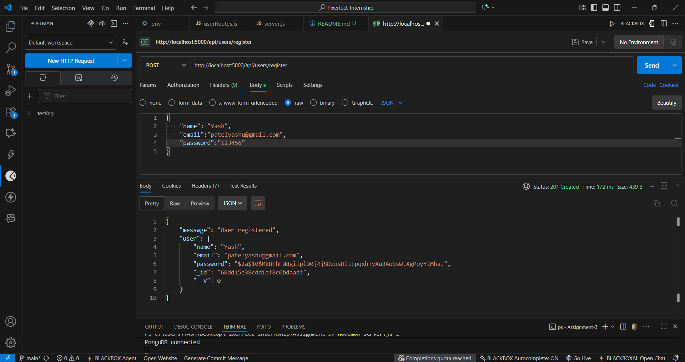
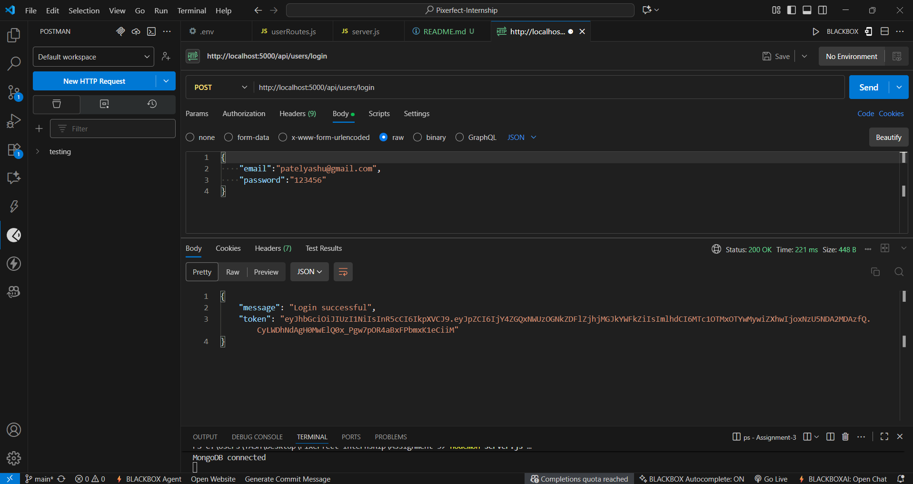
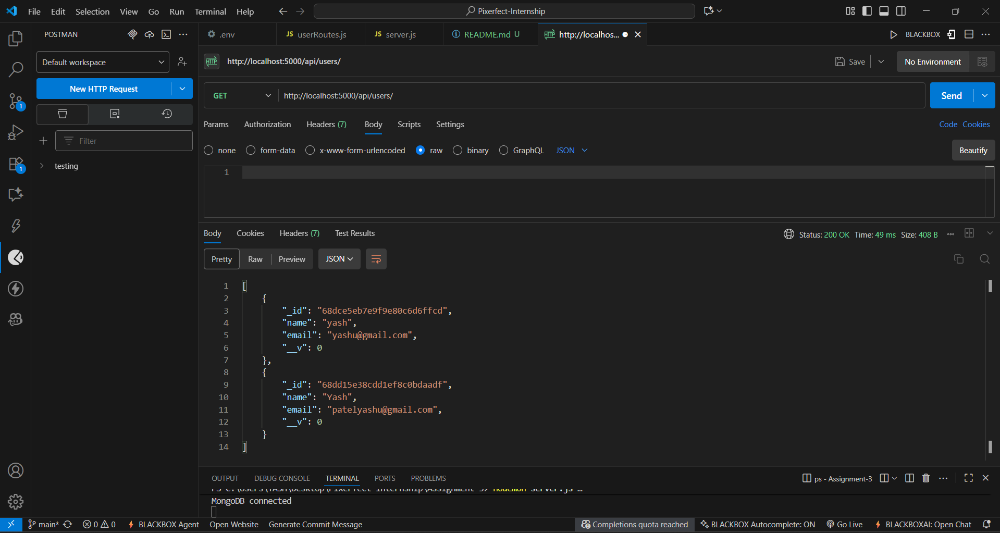
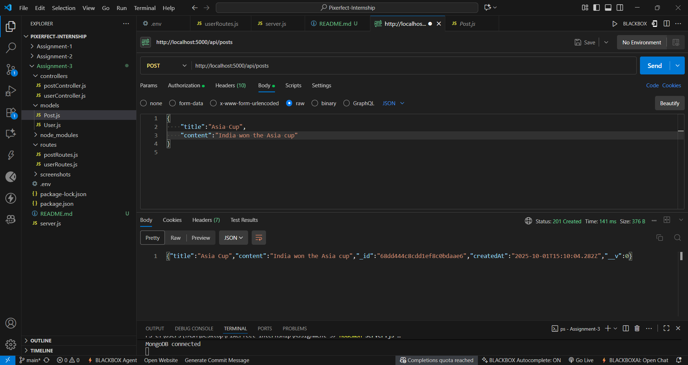
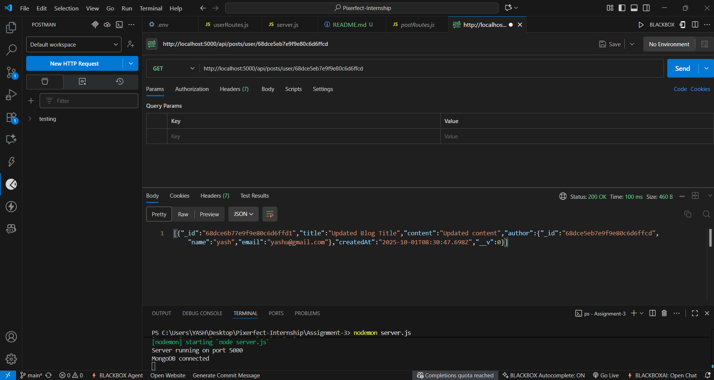
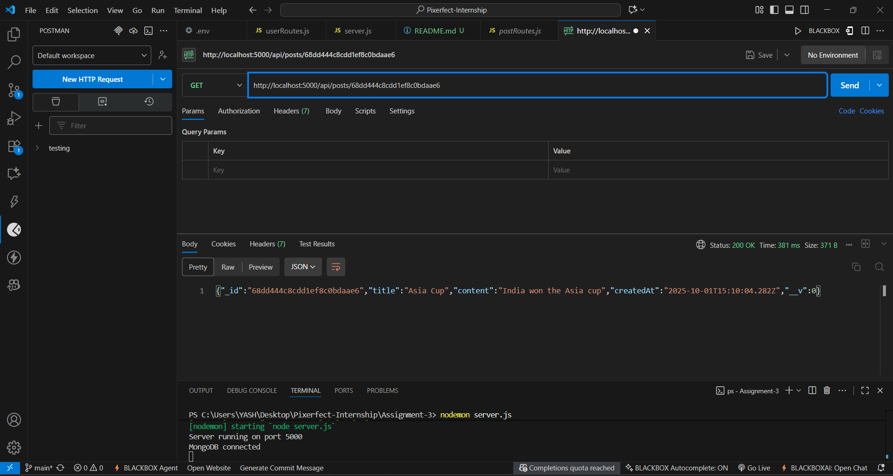
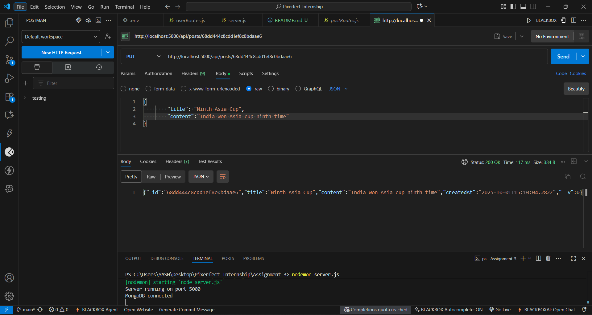
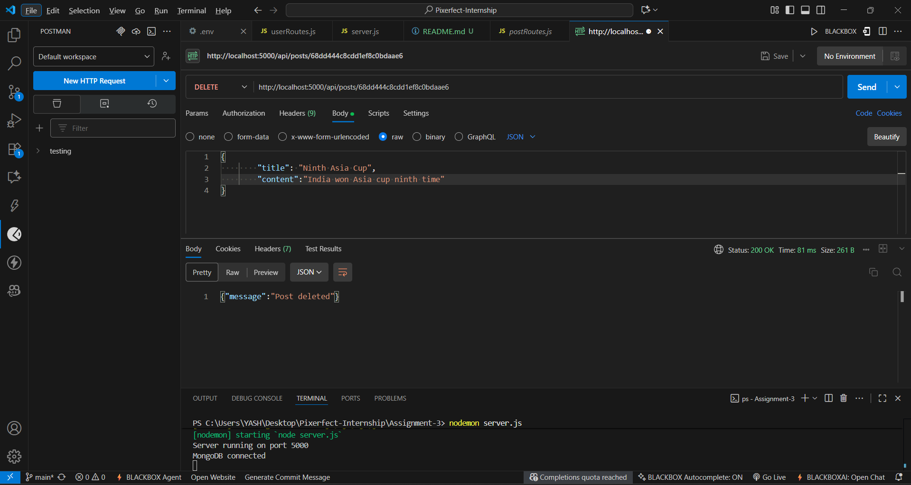
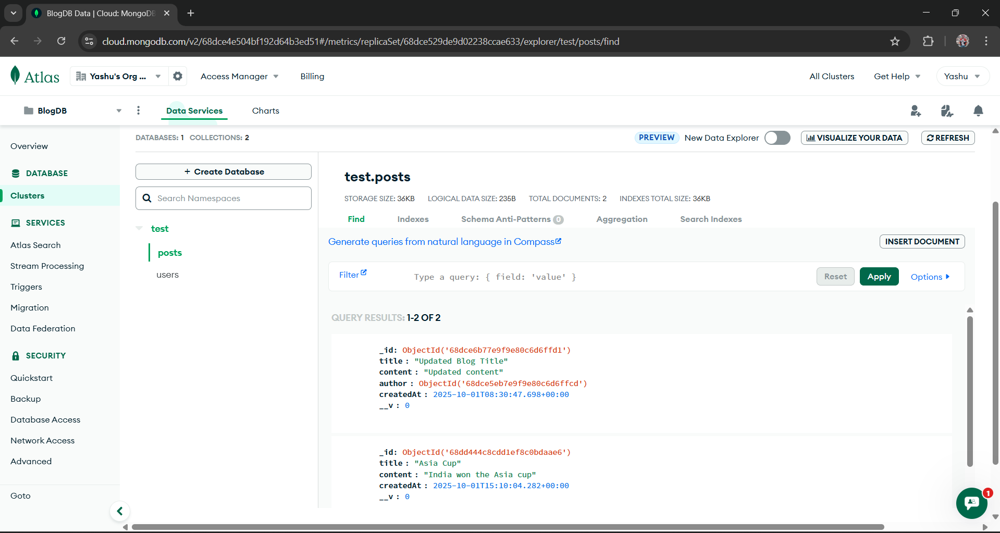

# Blog API (Assignment 3)

Simple RESTful Blog API built with **Node.js, Express, and MongoDB (Mongoose)**. Implements **Users** and **Posts**, plus **JWT authentication**, comments, and pagination.

---

## Features

- 👤 Register user (name, email, password)
- 🔑 Login (returns JWT)
- 📝 CRUD for posts (create, read, update, delete)
- 💬 Comments on posts
- 📄 Pagination and tag filter for posts
- 🔒 Author-only update/delete permissions

---

## Setup

1. Clone/download the project.
2. Install dependencies like express, mongoose, dotenv etc.
3. Create `.env` and set `MONGO_URI`, `JWT_SECRET`, etc.
4. Start database (MongoDB). For local development with default `.env`:
5. Start server using nodemon server.js

Server runs on `http://localhost:5000` by default.

## Endpoints

### Users

- `POST /api/users/register` — body: `{ name, email, password }`
- `POST /api/users/login` — body: `{ email, password }`
- `GET /api/users` — get all users (unprotected for practice)

### Posts

- `POST /api/posts` — create post (protected). Header: `Authorization: Bearer <token>` body: `{ title, content, }`
- `POST /api/posts` — Get All Posts
- `GET /api/posts/user/:userId` — fetch posts for a user
- `GET /api/posts/:Post_id` — get single post by id
- `PUT /api/posts/:Post_id` — update post (protected, only author)
- `DELETE /api/posts/:Post_id` — delete post (protected, only author)

## Example curl commands

### Register

curl -X POST http://localhost:5000/api/users/login

-H "Content-Type: application/json"
-d '{"email":"yash@gmail.com","password":"123456"}'

# 📸 Screenshots

## User Registration

## User Login

## Get All users

## Create Post

## Find Post using userId

## Find Post using postId

## Update Post

## Delete Post

## MongoDB database and Collections of Blog-api

