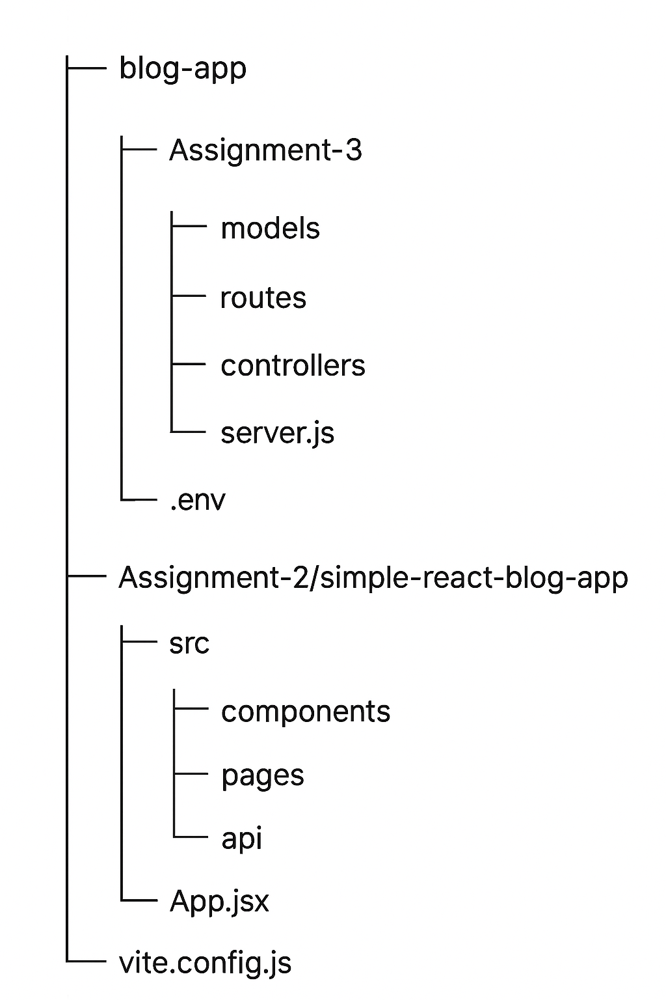
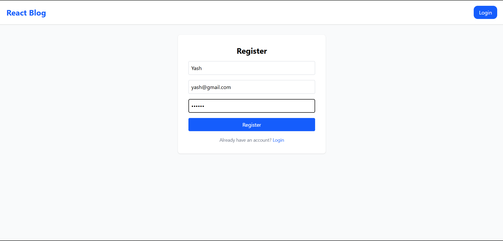
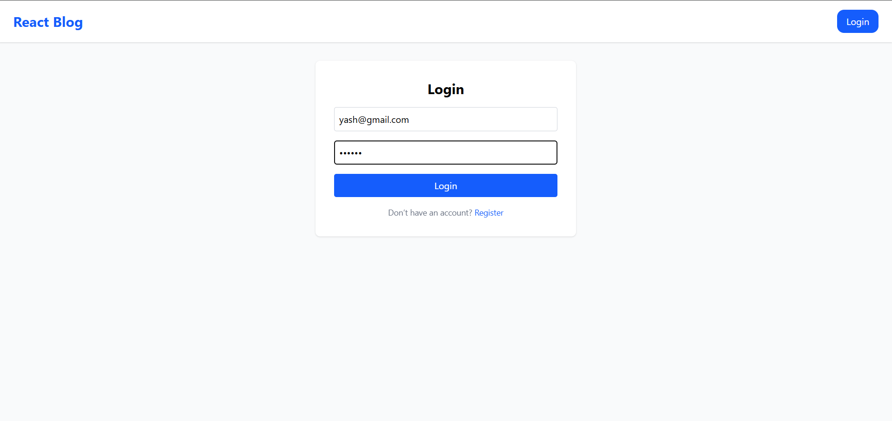
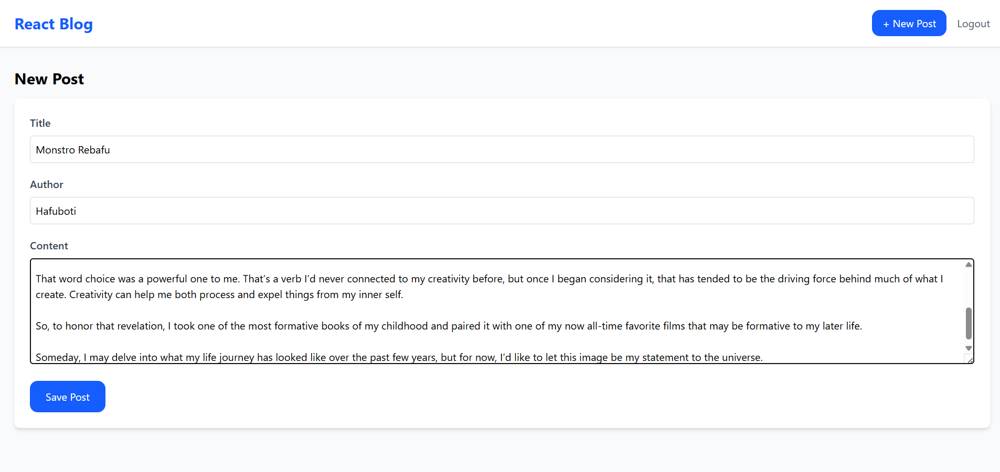
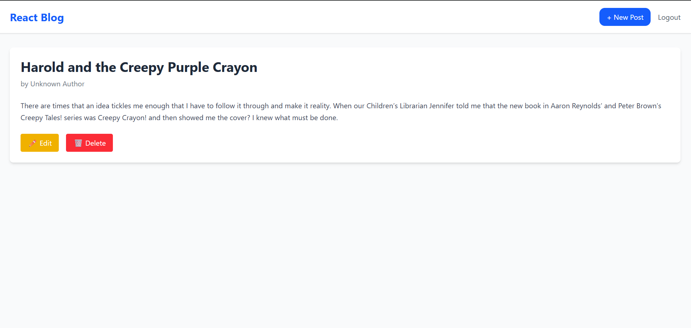
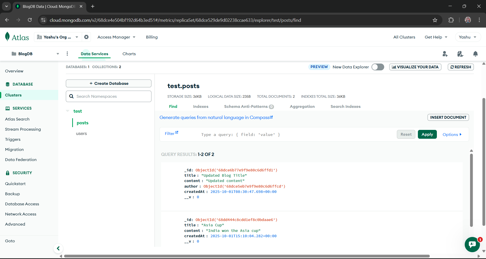

# 📝 Blog App (MERN Stack)

A full-stack **Blog Application** built using the **MERN** (MongoDB, Express, React, Node.js) stack.  
It allows users to register, log in, create, edit, and delete blog posts — with authentication and full CRUD operations.

---

## Project Structure

## 🚀 Features

### 👤 Authentication

- User Registration (Signup)
- User Login with JWT Authentication
- Secure Password Hashing using bcrypt

### ✍️ Blog CRUD Operations

- Create a new post
- Read all or individual posts
- Update an existing post
- Delete a post

### 💡 Additional Features

- Responsive frontend (React)
- RESTful API backend (Express)
- MongoDB database for persistent storage
- Protected routes for authenticated users

---

## 🧩 Tech Stack

| Layer          | Technology                   |
| -------------- | ---------------------------- |
| Frontend       | React, Vite, Axios           |
| Backend        | Node.js, Express.js          |
| Database       | MongoDB (Mongoose)           |
| Authentication | JSON Web Token (JWT), bcrypt |

---

🔐 Authentication Flow

- User registers or logs in to get a JWT token.
- Token is stored in local storage.
- Protected routes (like create/edit/delete post) require a valid token.
- If token is invalid or missing → access is denied.

# 📸 Screenshots

## User Registration

## User Login

## Create Post

## Update & Delete Post

## MongoDB database and Collections of Blog-api

